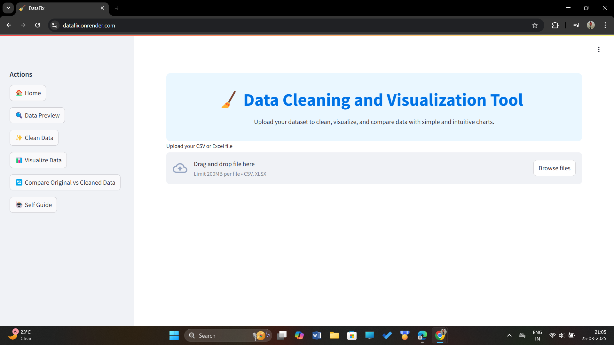
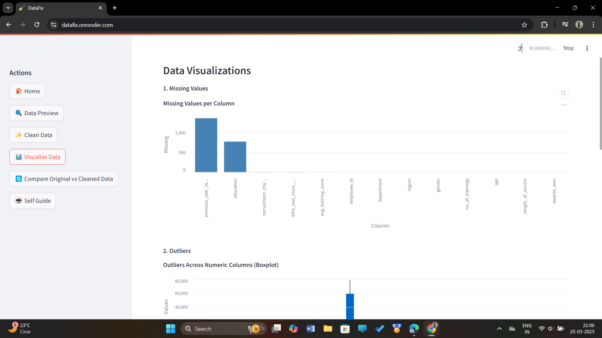
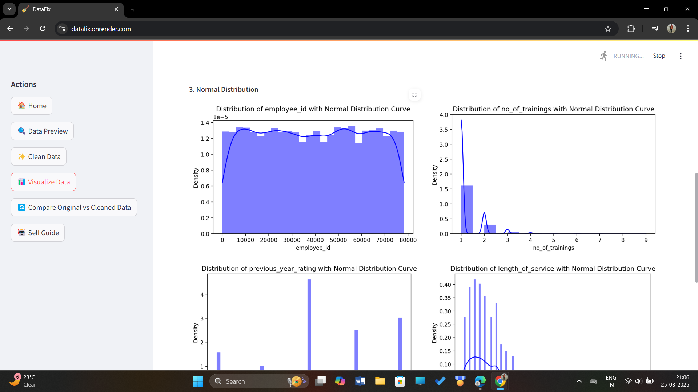

# DataFix: Data Cleaning & Visualization Tool

## 📌 Overview

DataFix is a powerful data cleaning and visualization tool that allows users to upload raw, uncleaned data and receive a cleaned version with meaningful insights. The tool automates data preprocessing tasks like handling missing values, removing duplicates, and normalizing formats, making it easier for users to analyze and visualize their data.




## 🔍 Features

Upload Raw Data: Users can upload uncleaned datasets (CSV, Excel, JSON, etc.).

Automated Data Cleaning: Handles missing values, duplicates, outliers, and formatting issues.

Data Transformation: Converts categorical variables, standardizes numerical data, and normalizes text data.

Visual Insights: Generates key charts and graphs for data exploration.

Download Cleaned Data: Users can download the processed dataset for further analysis.




## 📊 Technologies Used

Python (for data processing and automation)

Pandas, NumPy (for data manipulation)

Matplotlib, Seaborn, Plotly (for visualization)

Scikit-learn (for basic data transformation and anomaly detection)

Streamlit (for interactive web app deployment)

## 📂 Dataset Workflow

User Uploads Raw Data: Supports CSV, Excel, and JSON formats.

Data Cleaning Pipeline:

Handles missing values (removal/imputation).

Drops duplicates and fixes formatting inconsistencies.

Normalizes numerical values and encodes categorical variables.

Visualization Module:

Generates histograms, scatter plots, correlation heatmaps, and box plots.

Download Processed Data: Users can download the cleaned dataset in their preferred format.

## 🚀 How to Run the Project

Clone the repository:
```
git clone https://github.com/your-username/datafix.git
```
Navigate to the project directory:
```
cd datafix
```
Install dependencies:
```
pip install -r requirements.txt
```
Run the app:
```
streamlit run app.py
```
📈 Insights Gained

Data Quality Assessment: Identifies inconsistencies and missing data patterns.

Feature Distribution Analysis: Visualizes data trends for better understanding.

Correlation Mapping: Finds relationships between variables to enhance decision-making.

Anomaly Detection: Detects and handles outliers that may affect analysis.

## 📜 Future Improvements

Advanced Anomaly Detection: Implement ML models for better outlier detection.

Integration with Databases: Support for SQL and NoSQL databases for large datasets.

Custom Cleaning Options: Allow users to choose their preferred cleaning methods.

Automated Report Generation: Generate reports summarizing data cleaning steps and insights.

## 🏆 Contributions

Feel free to fork this repository and contribute to improve this project! If you have any suggestions, open an issue or create a pull request.

## 📩 Contact

For any queries or collaborations, reach out via:

#### 📧 Email: your-priyachanchal169@gmail.com

🔗 LinkedIn: https://www.linkedin.com/in/priya-chanchal-050b86288/
